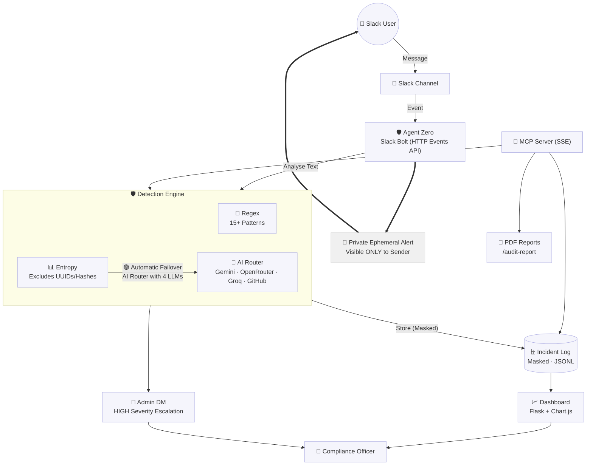

# Agent Zero

**Real-time credential leak detection and remediation for Slack.**


Agent Zero is an autonomous compliance guardian for your Slack workspace. It actively monitors channels for leaked secrets, API keys, passwords, and sensitive PII, instantly flagging risks to administrators while preserving team workflows.

## Features

- **Real-time monitoring**: Employs hybrid regex and AI semantic detection to catch leaked credentials immediately.
- **Calm UX dashboard**: A beautiful, soothing pastel design to visualize and monitor compliance metrics without alert fatigue.
- **Mark as Safe**: False positive learning engine lets users dismiss alerts and teach the system to ignore harmless patterns.
- **15+ credential patterns**: Natively detects plaintext passwords, API tokens, AWS keys, Stripe keys, credit cards, SSH keys, database connection strings, and more.
- **Smart deduplication**: Consolidates overlapping regex matches into single alerts (no duplicate notifications).
- **Slash commands**: Interact directly via Slack using `/audit-scan`, `/audit-report`, `/audit-search`, and `/audit-status`.
- **Multi-Provider AI Router**: High-availability AI validation across Gemini, OpenRouter, Groq, and GitHub Models to drastically reduce false positives.
- **MCP Server (SSE)**: Native Model Context Protocol server integration allowing autonomous agentic workflows and tool execution.
- **PDF compliance report generation**: Automated, boardroom-ready exports of your workspace's security posture.
- **Docker support**: Fully containerized and production-ready.
- **Comprehensive test suite**: Backed by a 23-check automated verification suite ensuring unbreakable reliability.

## Tech Stack

- **Core**: Python 3.11
- **Integrations**: Slack Bolt Framework (HTTP Events API), Model Context Protocol (FastMCP)
- **Web Dashboard**: Flask, HTML5, CSS3, Chart.js
- **AI Integration**: Google GenAI, Requests (for OpenAI-compatible endpoints)
- **Storage**: JSONL (Append-only)
- **Deployment**: Docker, Docker Compose, PythonAnywhere

## Getting Started

1. **Clone the repository:**
   ```bash
   git clone git@github.com:Abdulrahman-Alfeqy/AgentZero.git
   cd AgentZero
   ```

2. **Configure Environment:**
   Copy the example config and fill in your Slack and API keys.
   ```bash
   cp .env.example .env
   ```

3. **Install Dependencies:**
   ```bash
   python -m venv .venv
   source .venv/bin/activate
   pip install -r requirements.txt
   ```

4. **Run Agent Zero:**
   ```bash
   python main.py
   ```

## Environment Variables

| Variable | Description |
|----------|-------------|
| `SLACK_BOT_TOKEN` | Slack Bot token (starts with `xoxb-`) |
| `SLACK_APP_TOKEN` | (Not required in HTTP mode) App-level token for local Socket Mode dev only |
| `SLACK_SIGNING_SECRET` | Secret used to verify Slack requests. **Required** — never disable. |
| `COMPLIANCE_OFFICER_ID` | Slack User ID to receive HIGH severity alerts via DM |
| `DASHBOARD_HOST` | Host to bind the dashboard. Default: 0.0.0.0 (works for local and cloud). Set to 127.0.0.1 for local-only. |
| `DASHBOARD_PASSWORD` | Web dashboard password |
| `DASHBOARD_USERNAME` | Web dashboard username |
| `GEMINI_API_KEYS` | (Optional) Comma-separated list of Gemini API keys |
| `GITHUB_TOKEN` | (Optional) Fallback AI validation via GitHub Models |
| `GROQ_API_KEY` | (Optional) Fallback AI validation via Groq |
| `MCP_SERVER_PORT` | Port for the MCP server (default: 5001). Host is configurable via MCP_SERVER_HOST. |
| `OPENROUTER_API_KEY` | (Optional) Fallback AI validation via OpenRouter |
| `PORT` | Port for the web server. Render/Fly.io use this dynamically. Default: 5000. |

## Dashboard Access

Once Agent Zero is running, you can access the compliance dashboard via your browser:
- **URL**: `http://localhost:5000/dashboard`
- **Username**: `admin` (or your custom `DASHBOARD_USERNAME`)
- **Password**: `agentzero` (or your custom `DASHBOARD_PASSWORD`)

For cloud deployment, ensure DASHBOARD_HOST=0.0.0.0 and PORT=5000 are set.

## Architecture Overview



## Deploying to PythonAnywhere

PythonAnywhere's free tier provides exactly one WSGI web app with a public HTTPS
domain. Agent Zero is compatible because it is structured as a single Flask app
object after the HTTP Events API migration.

### WSGI Configuration File

In your PythonAnywhere dashboard, go to **Web → WSGI configuration file** and
replace the default content with:

```python
import sys
import os

# Point to your project directory
sys.path.insert(0, '/home/<your-username>/AgentZero')

# Load environment variables from .env
from dotenv import load_dotenv
load_dotenv('/home/<your-username>/AgentZero/.env')

# Import the consolidated Flask app
from main import flask_app as application
```

### Slack Event Subscriptions URL

In your Slack App settings, go to **Event Subscriptions → Request URL** and set:

```
https://<your-username>.pythonanywhere.com/slack/events
```

Slack will send a `url_verification` challenge — Bolt's adapter handles it
automatically. Wait for the green tick before saving.

### Bot Events to Subscribe

Under **Event Subscriptions → Subscribe to bot events**, add:

| Event | Reason |
|-------|--------|
| `message.channels` | Scan public channel messages |
| `message.groups` | Scan private channel messages |
| `message.im` | Scan direct messages |
| `message.mpim` | Scan group direct messages |
| `member_joined_channel` | Welcome message on bot invite |
| `app_home_opened` | Render the App Home tab |

### Outbound API Allowlist

PythonAnywhere's free tier restricts outbound HTTP to an allowlist. Add these
domains via **Account → Whitelist a new domain** for AI provider support:

| Domain | Provider |
|--------|----------|
| `generativelanguage.googleapis.com` | Gemini |
| `openrouter.ai` | OpenRouter |
| `api.groq.com` | Groq |
| `models.inference.ai.azure.com` | GitHub Models |

If any domain is not allowlisted, that AI provider is skipped silently and the
fallback chain continues. The app never crashes on a missing provider — it
degrades to regex-only detection, exactly as documented for a blank API key.

### Persistent Storage Note

PythonAnywhere free tier does provide persistent disk storage, so `incidents.jsonl`
and generated PDFs survive restarts (unlike Render's free tier).

## Roadmap

- Migrate from JSONL to a scalable relational database (SQLite/PostgreSQL) for large workspace querying.
- Introduce WebSockets for real-time, zero-refresh dashboard updates.
- Support full Slack OAuth flow for multi-workspace public distribution.

## License

This project is licensed under the MIT License. See the [LICENSE](LICENSE) file for details.
